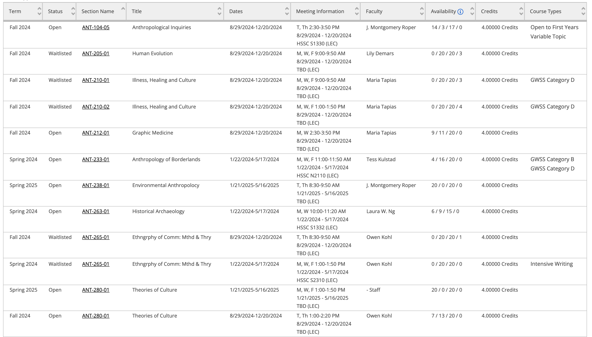
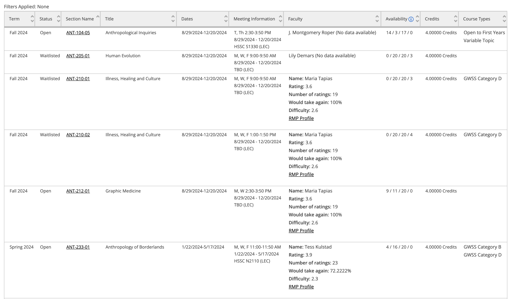

# Grinnell Rating Extension

**I strongly believe that professor ratings should not be the sole factor in determining the quality of a course or instructor. I encourage students to use this tool as a supplement to other resources and to consider the limitations of such ratings. Please be respectful and considerate when using this tool.**

**Note: I do not promote the use of this extension without understanding the implications of using it. This extension is not officially endorsed by Grinnell College. Use at your own risk. Database may contain errors or outdated information.**

## Description

Grinnell Rating Extension is a Chrome extension that allows students to view instructor ratings and reviews directly on the [Grinnell College Student Portal](https://colss-prod.ec.grinnell.edu/Student/Courses/) website. The extension displays ratings and reviews from the Rate My Professor website, providing students with additional information to make informed decisions when selecting courses and instructors.

## Installation

**Download the extension from the Chrome Web Store. (DOESN'T WORK NOW)**

**Alternatively, you can download the source code and load the extension manually by following the instructions below.**

1. Clone the repository or download the source code as a ZIP file.
2. Extract the ZIP file (if downloaded).
3. Open Chrome and navigate to `chrome://extensions/`.
4. Enable Developer mode by toggling the switch in the top right corner.
5. Click on the `Load unpacked` button and select the extracted folder.
6. The extension should now be installed and ready to use.

## Screenshots

### Without extension:

### With extension:

## Database

This extension has a static database of instructors and ratings that are not updated in real-time. The database is based on the Rate My Professor website and may contain errors or outdated information. Below are the instructions to update the database manually.

### Update the database by following these steps:

1. Open the `DatabaseUpdater.py` file in the `Database` folder.
2. Run the script to update the database.
3. The script will scrape the Rate My Professor website and update the database.
4. Database requires manual moderation to ensure accuracy and reliability.
5. The updated database will be saved as a JSON file in the `Database` folder.